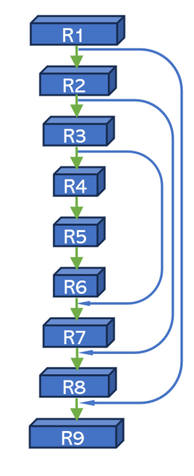
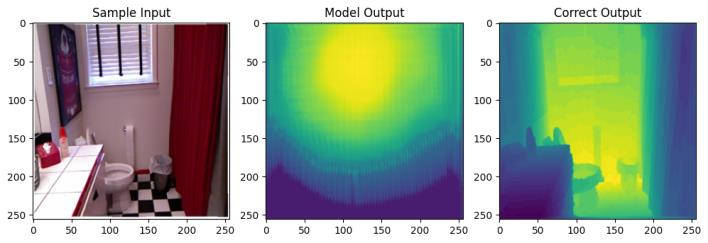
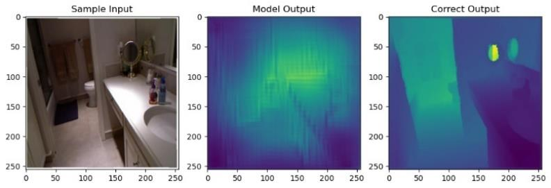

# CS7050 AI Robotics Group Project - Residual Connection LSTM with Single Image Depth Estimation

The [PDF Report](https://github.com/arigold24k/CS7050_AI_Robotics_GroupProject/releases/download/Downloads/Residual.Connection.LSTM.-.Single.Image.Depth.Estimation.pdf) is avaiable for download


---

# Residual Connection LSTM: Single-Image Depth Estimation

## Overview
This project introduces a novel approach for single-image depth estimation by incorporating Long Short-Term Memory (LSTM) functionality into a double hourglass Convolutional Neural Network (CNN). The proposed model, Residual Connection LSTM, effectively combines temporal dependencies and spatial information to achieve superior accuracy and robustness in depth estimation tasks.

## Features
- **Double Hourglass CNN**: Leverages residual connections for efficient feature extraction.
- **LSTM Integration**: Captures temporal dependencies to improve estimation accuracy.
- **Combined Loss Function**: Uses Mean Squared Error (MSE) and perceptual loss to enhance output detail.
- **Dataset**: Trained on the NYU V2 Depth dataset for diverse indoor scenes.

## Motivation
Depth estimation is a critical task in computer vision, enabling applications like autonomous vehicles, robotics, and AR/VR. Current methods often struggle with noisy inputs or lack the ability to utilize temporal information effectively. Our approach addresses these challenges by integrating LSTM with a robust CNN architecture.

## Model Architecture
The Residual Connection LSTM model builds upon the "AutoDepth" framework with key enhancements:
1. **CNN Encoder**: Features 7 convolutional layers with ReLU activation and residual connections after every two layers.
2. **LSTM Layer**: Processes the encoder output to capture temporal dependencies.
3. **Hourglass Module**: Comprises 9 residual blocks with varying kernel sizes to encode and decode spatial features.
4. **Residual Connections**: Combines LSTM output and hourglass features for improved depth estimation.



## Implementation Details
### Hyperparameters
- **Optimizer**: Adam
- **Learning Rate**: 0.001
- **Dropout**: 0.2 to prevent overfitting

### Loss Function
The combined loss function balances accuracy and detail:
```
Loss = MSELoss + 0.5 * PerceptualLoss
```
An additional penalty term ensures output variability to avoid flat depth maps.

### Dataset
- **Dataset**: NYU V2 Depth
- **Training Subset**: 20% of the dataset (795 images) due to hardware constraints

## Training
Training occurred in two phases:
1. **Phase 1**: 250 epochs using MSE loss.
2. **Phase 2**: 50 epochs using the combined loss function.

### Performance
The proposed model demonstrated:
- Faster convergence compared to the base model.
- Superior detail in output depth maps when using the combined loss function.

Pure MSE Loss:


MSE and Perceptual Loss Combined:



## Results

The Residual Connection LSTM outperformed the base model in both training loss and qualitative depth map detail, particularly when trained with the combined loss function.

Below are two further examples of outputs:


## Future Work
- Train for longer periods of time in order to achieve better results.
- Incorporate additional datasets like the IKEA dataset for broader generalization.
- Experiment with architectural variations and batch size adjustments.
- Optimize training for larger datasets.

## References
1. Kumari, S., Jha, R. R., Bhavsar, A., & Nigam, A. (2019). "AutoDepth: Single Image Depth Map Estimation via Residual CNN Encoder-Decoder and Stacked Hourglass". *IEEE International Conference on Image Processing (ICIP)*.
2. Eigen, D., & Fergus, R. (2015). "Predicting Depth, Surface Normals, and Semantic Labels with a Common Multi-Scale Convolutional Architecture". *IEEE International Conference on Computer Vision*.
3. Liu, F., Shen, C., & Lin, G. (2015). "Deep Convolutional Neural Fields for Depth Estimation from a Single Image". *IEEE Conference on Computer Vision and Pattern Recognition*.

## Contributors
- Aidan Mitchell (amitc173@students.kennesaw.edu)
- Ariel Vidal (avidal4@students.kennesaw.edu)
- Jaskirat Sohal (jsohal@students.kennesaw.edu)

## License
This project is licensed under the MIT License - see the LICENSE file for details.

